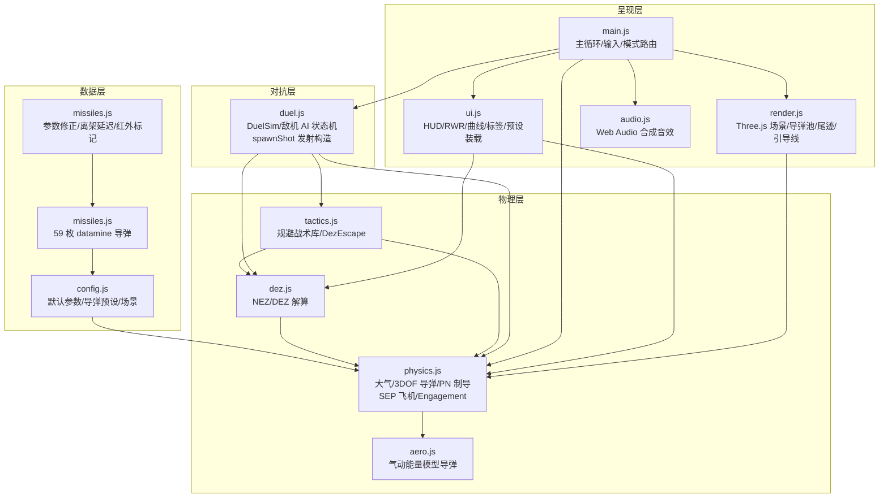
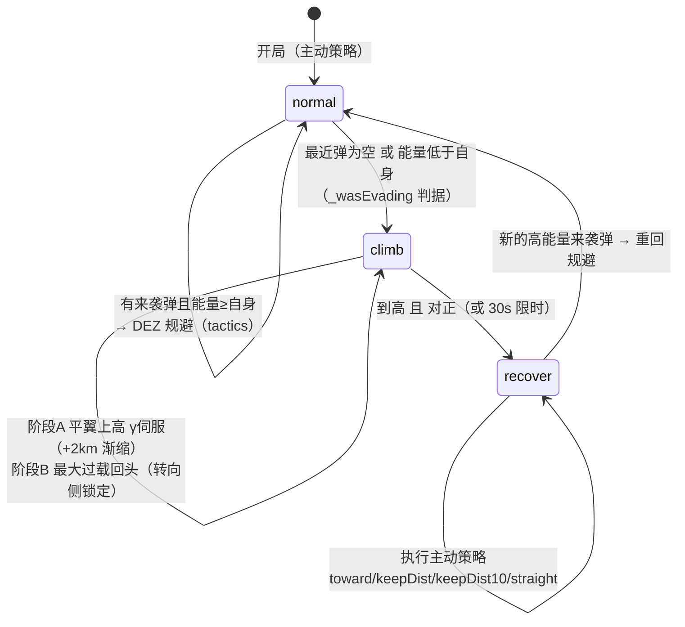
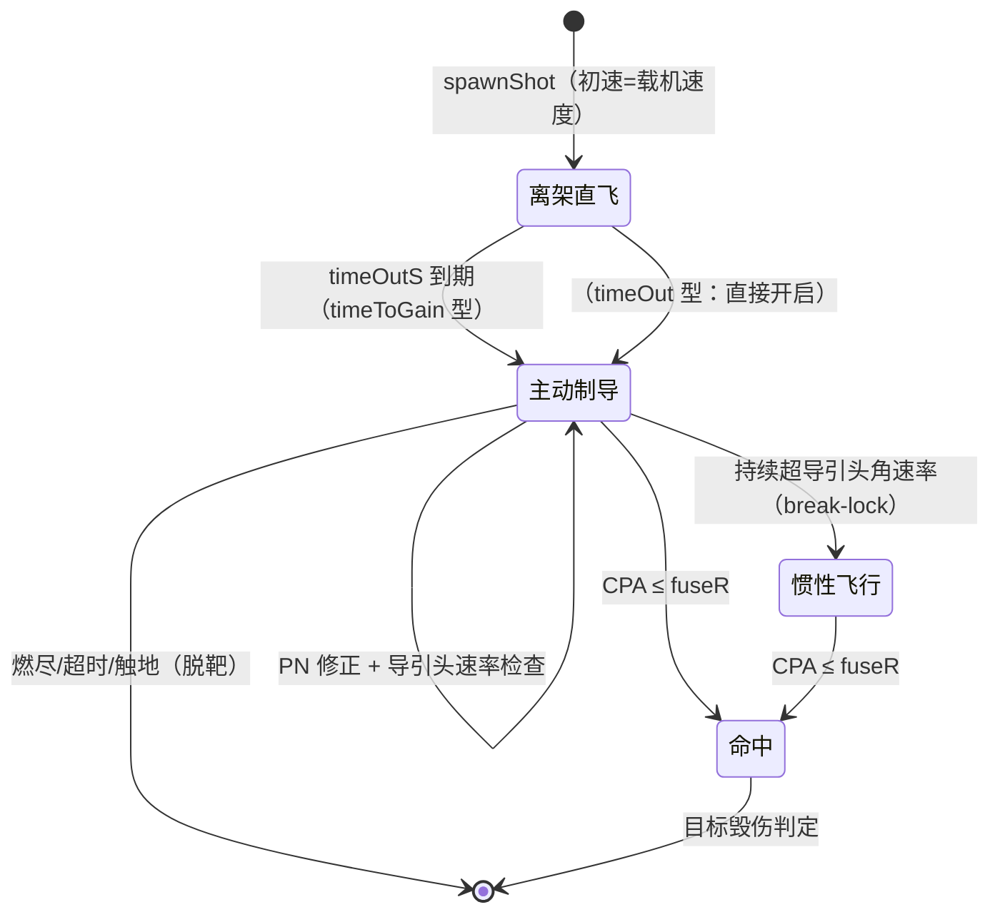
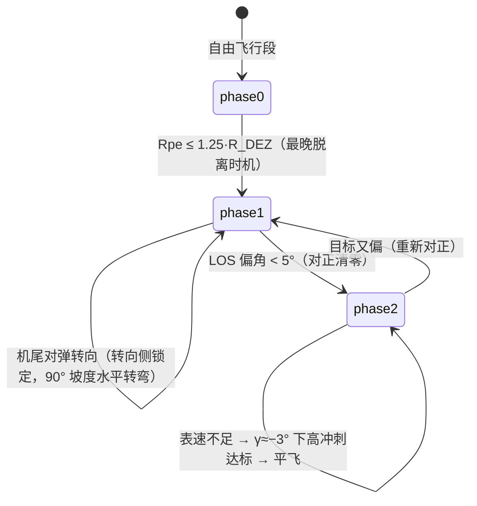
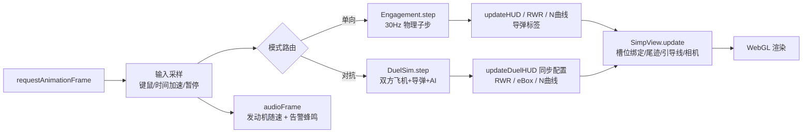

# 架构文档 ARCHITECTURE

> War Thunder 风格 3D 导弹攻防模拟器 —— 模块结构、核心原理与代码框架
> 配套阅读：[README.md](README.md)（功能与操作）

## 1. 项目概览

纯前端实时 3D 导弹攻防模拟：**单向拦截模式**（来袭导弹 → 我机 → 发射拦截弹）与
**对抗模式**（玩家 vs 敌机 AI，互射导弹 + 自动规避）。物理内核对标 War Thunder
（Dagor Engine）datamine 数据，含 63 枚真实导弹参数、DEZ/NEZ 空战决策算法
（Alkaher & Moshaiov 2015）、SEP 能量机动模型。

**技术约束**：vanilla HTML/JS + Three.js r147（UMD），`file://` 直接打开，
无构建步骤、无外部依赖、无网络请求。

## 2. 系统结构图



依赖方向严格单向：**数据层 ← 物理层 ← 对抗层 ← 呈现层**。
全局命名空间仅一个：`window.WT`（各模块挂载子对象，见 §6）。

## 3. 核心原理

### 3.1 大气模型（Dagor Engine 移植）

0–18300 m 用**单条 4 阶多项式**拟合（`atmPoly`），之上 1/h 尾部延拓：

| 量 | 公式 | 校验锚点 |
|---|---|---|
| 温度 T | `T0 + poly(h)` | T(10km)=223.82 K |
| 声速 a | `20.1·√T` | a(0)=341.20 m/s |
| 密度 ρ | `P0/(R·T)·poly2` | ρ(15km)=0.20833 |

表速↔真空速换算：`V_TAS = V_EAS·√(ρ0/ρ)`（不同高度限速真空速不同）。

### 3.2 导弹（3DOF 质点 + 比例导引）

```
运动：pos += vel·dt；速度沿弹体纵轴（无侧滑）
制导：a = N·Vc·(ω_los × v̂)        ← 比例导引 PN（proportional navigation）
推进：分级固体火箭（逐级 fuel/thrust/mDry 秒流量）
阻力：Cx(M)×1.10（1943 阻力律）；诱导阻力 CxAoA = k_L²/(π·3)
离架：timeOutS 直飞段（或 timeToGain 零增益平台）后开启引导
引信：连续 CPA 近炸（segMinDist 线段最近距离）
导引头：角速率限制 seekerRateMaxDeg，持续超限 → break-lock 惯性飞行
发射：初速 = 载机速度矢量（与载具此后无关）
```

过载包线（右上角曲线的数据源）：

```
n_max(M) = min( 舵面平台 finsLatAccel, q·S·k_L·α_max/(m·g) )
```

### 3.3 飞机（SEP 能量机动模型）

```
能量方程：d(h + V²/2g)/dt = SEP
实时 SEP = 最大油门SEP × 油门百分比 − sepMax·(V_EAS/V_max)² + 机动损失·ratio
           └── 油门百分比 0..100%（SHIFT 增 / CTRL 减）；阻力∝V²：超限速时 SEP 为负
机动损失 ratio = (|n|−1)/(n_max−1)；最大过载损失默认 −200 m/s
法向过载：0 杆=1G 配平；ω = (n − upY)·g/V
          upY = 姿态上轴的世界竖直分量 → 上拉克服重力、下俯/倒飞重力助推
```

### 3.4 NEZ/DEZ（Alkaher & Moshaiov 2015）

- **NEZ**（不可逃逸区）：coastRange 弹道积分迭代求解
- **DEZ**（动能对抗区）：`R_DEZ = NEZ + 逃逸增量`（同法积分）
- 判据：`Rpe ≤ 1.25·R_DEZ` → **立即脱离！**；`NEZ < Rpe ≤ 1.25·DEZ` → 对抗区；`Rpe > 1.25·DEZ` → 安全区

## 4. 状态图

### 4.1 敌机 AI 状态机（duel.js `_enemyCmd`）



**主动策略偏角律**（keepDist 系列）：机头偏角 θ 由间距误差的径向速度伺服给出
`Ṙ = 0.15·(d*−R)`，`θ = acos(−Ṙ/V)` —— 过远直指（poke）、恰在 d* 切向守距、过近 θ>90° 拉开。

### 4.2 导弹生命周期



### 4.3 DezEscape 战术阶段（tactics.js）



## 5. 帧循环数据流



## 6. 代码框架

| 文件 | 职责 | 关键 API（挂 `WT.*`） |
|---|---|---|
| `config.js` | 默认参数、4 枚基础导弹预设、场景预设 | `WT.DEFAULTS` `WT.MISSILE_PRESETS` |
| `missiles.js` | 59 枚 datamine 导弹参数（合计 63 枚） | 同上（增量注入） |
| `missiles.js` | 修正系数/离架延迟/红外标记 | 同上（补丁） |
| `physics.js` | 大气、3DOF 导弹、PN、分级火箭、飞机（const/aero）、Engagement | `WT.phys.{atmosphere, Aircraft, Missile, Engagement, segMinDist, attitudeAngles, angDiff, clamp, mulberry32}` |
| `aero.js` | 气动能量模型导弹（同制导/推进，速度用能量方程） | `WT.AeroMissile` `WT.nMaxAtMach` |
| `dez.js` | coastRange 弹道积分 + NEZ/DEZ 迭代解算 | `WT.dez.{computeRdez, MARGIN, status}` |
| `tactics.js` | 规避战术（最大G盘旋/置尾/置尾平飞/DEZ）、转向侧锁定、方位解算 | `WT.tactics.{create, missileBearing, missileElevation}` |
| `duel.js` | DuelSim（双机+导弹池）、敌机 AI 状态机、`spawnShot/stepShot/inFrontHemisphere` | `WT.DuelSim` `WT.spawnShot` `WT.stepShot` |
| `render.js` | Three.js 场景、程序化机体、导弹池（环形槽位）、尾迹、引导线、爆炸 | `WT.SimView` |
| `ui.js` | HUD/RWR/过载-马赫曲线/浮动标签/场景预设装载/面板收集 | `WT.ui.*` |
| `audio.js` | Web Audio 合成音效（发射/爆炸/告警/发动机） | `WT.audio.*` |
| `main.js` | 启动、主循环、输入、模式路由、拦截弹发射 | （模块私有） |

### 关键机制备忘

| 机制 | 设计 |
|---|---|
| 导弹池 | 环形槽位（上限 1024）：死弹尾迹保留、满员覆盖最旧；槽位与弹**稳定绑定**（防死弹引起错位） |
| 尾迹 | 按**仿真时间** 30Hz 采样（帧率无关），容量按寿命/推进时间申请；黄=动力段、黑=滑行段 |
| 引导线 | 每发导弹一条红线连**锁定目标**（`m.lockTarget`，spawnShot 统一记录） |
| RWR | ≤19km 告警；红外弹（`irSeeker`）不告警；敌机标记无字母；径向=线性距离刻度（无位移） |
| 导弹标签 | ≤19km 雷达弹显示"⚡雷达开机" |
| 音效 | 惰性 AudioContext（手势解锁）、无 AudioContext 环境全 API 安全 |

## 7. 测试体系

`tools/smoke-test.js` —— **130 项无头回归**（`node tools/smoke-test.js`）：

- DOM/Canvas 代理桩 → UI 链路可测（含 init 链路、RWR 绘制、标签三态）
- 物理锚点：大气校验值、能量方程守恒（ΔE = ∫g·SEP）、PN 拦截几何
- 论文锚点：DEZ/NEZ 数值、DEZ 规避成功/保持高度
- 行为锚点：敌机状态机（能量判据/回头不卡死/保持距离策略）、发射约束（前半球）
- 契约锚点：锁定目标≠自身、初速=载机速度、红外不告警、雷达开机阈值

**发布流程**：`Compress-Archive` → 全新解压 → 冒烟测试全绿 → 发布（缓存版本 `?v=N` 必须递增）。

## 8. 扩展指南

| 想做什么 | 改哪里 |
|---|---|
| 加导弹 | `missiles.js` 增预设（字段见 config.js 注释）；红外弹在 `missiles.js` 的 `IR_KEYS` 标记 |
| 加规避战术 | `tactics.js` 增 `Tactic` 子类，注册进 `WT.tactics.create` 的表 |
| 加场景 | `ui.js` 的 `SCENARIOS` 表 + `index.html` 的 `selScenario` 选项 |
| 调物理 | `physics.js`（飞机 SEP/过载）、`aero.js`（导弹气动）；跑冒烟测试守回归 |

## 9. 目录结构

```
wt-missile-simulator/
├── index.html          入口（双击即玩）
├── css/style.css
├── lib/three.min.js    Three.js r147（UMD）
├── js/                 见 §6
├── tools/
│   ├── smoke-test.js   130 项无头回归（node 直跑）
│   ├── debug-ai.js     敌机状态机时间线调试
│   └── micro-turn.js   转向方向符号实证
├── README.md           功能/操作/参数
├── ARCHITECTURE.md     本文档
├── LICENSE             MIT（含第三方声明：Three.js/datamine 数据来源）
├── .gitignore
└── 踩坑记录.md         工程经验（bug 复盘）
```
