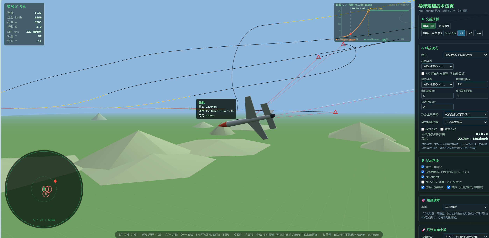
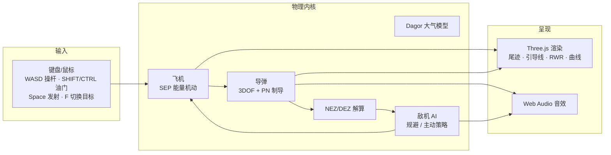

# wt-missile-simulator · War Thunder 风格 3D 导弹攻防模拟器

> 纯前端实时 3D 导弹攻防仿真：**双击即玩、离线可用、零依赖安装**。
> 单向拦截 + 玩家 vs AI 对抗，63 枚真实 datamine 导弹，NEZ/DEZ 空战决策算法。

🚀 **[在线演示 · 打开即玩](https://matrixsukhoi.github.io/wt-missile-simulator/)**（GitHub Pages 部署，无需安装；按任意键解锁音效）



*对抗模式实战：**黄**=导弹动力段尾迹、**黑**=滑行段；**红线**=每发导弹的引导线（连其锁定目标）；
红色三角=敌方导弹标记；左下 **RWR**（M=来袭弹，≤19km 雷达弹告警）；右上 **过载-马赫包线曲线**；
左上 飞行 HUD（SEP @油门%）；右侧 参数面板（敌方主动/规避策略、导弹型号、初速/高度全可配）*

## 快速开始

**在线**：点击上方 [在线演示](https://matrixsukhoi.github.io/wt-missile-simulator/) 即可游玩。
**本地**：双击 `启动.bat`（或直接用浏览器打开 `index.html`）。
无构建、无联网、无安装 —— Three.js 已本地化在 `lib/`。

## 系统框图



双模式：**单向拦截**（来袭弹 → 我机规避 → 发射拦截弹）与
**对抗**（玩家 vs 敌机 AI，互射导弹 + 自动规避 + 保持距离 poke 策略）。

## 核心算法

### 1. 大气模型（Dagor Engine 逐位移植）

0–18300 m 单条 4 阶多项式拟合，之上按 1/h 尾部延拓：

```
T(h) = T₀ + poly₄(h)          T₀ = 288.16 K
a(h) = 20.1·√T                声速
ρ(h) = P₀ / (R·T) · poly₂     P₀ = 101300 Pa
表速↔真空速：V_TAS = V_EAS·√(ρ₀/ρ)     （不同高度限速真空速不同）
```

校验锚点：a(0) = 341.20 m/s，ρ(15km) = 0.20833，T(10km) = 223.82 K。

### 2. 导弹：3DOF 质点 + 比例导引（PN）

```
制导：a = N·Vc·(ω_los × v̂)          N = pnGain（datamine propNavMult，4~6）
推进：分级固体火箭，逐级 {t, thrust, massLost}，质量线性递减
阻力：Cx = Cx(M)·1.10（1943 阻力律）；诱导阻力 CxAoA = k_L²/(π·3)
过载包线：n_max(M) = min( 舵面平台 finsLatAccel, q·S·k_L·α_max/(m·g) )
导引头：角速率超限持续 → break-lock（惯性飞行）
引信：连续 CPA（弹目线段最近距离）≤ fuseR → 命中
发射：初速 = 载机速度矢量（发射后与载具无关）
```

### 3. 飞机：SEP 能量机动模型

```
实时 SEP = 最大油门SEP × 油门百分比 − sepMax·(V_EAS/V_max)² + 机动损失·ratio
                └── 油门 0~100%（SHIFT/CTRL）   └── 阻力∝V²：超限速 SEP 为负
机动损失 ratio = (|n|−1)/(n_max−1)，满过载取 gLossMax（默认 −200 m/s）
能量方程：d(h + V²/2g)/dt = SEP
   爬升（γ>0）→ 动能换高度；俯冲（γ<0）→ 高度换速度
```

### 4. 法向过载与重力耦合

```
0 杆 = 1G 配平；满杆 = n_max（默认 10G）
ω = (n − upY)·g / V
upY = 机体系上轴的世界竖直分量：
   平飞上拉 → 需克服重力（ω = (n−1)·g/V）
   下俯/倒飞 → 重力助推（ω = (n+1)·g/V）
```

### 5. NEZ / DEZ（Alkaher & Moshaiov 2015）

对每枚来袭弹做**弹道数值积分**（coastRange：逐级推进 + 阻力减速到能量耗尽），
迭代求解：

```
NEZ = 不可逃逸区半径（命中所需最小发射/逃逸距离）
DEZ = NEZ + 逃逸增量（动能对抗边界）
判据：Rpe ≤ 1.25·DEZ → 立即脱离
      NEZ < Rpe ≤ 1.25·DEZ → 对抗区
      之外 → 安全区
```

### 6. 敌机 AI：决策与保持距离偏角律

```
比能量决策：e = V²/2 + g·h
   导弹 e ≥ 自身 → 维持 DEZ 规避（不转身送头）
   导弹 e < 自身 或 无来袭弹 → 平翼上高(+2km) + 最大过载回头 → 主动策略

保持距离偏角律（"转向敌机·保持 d*"）：
   Ṙ = k·(d* − R)          d* = 10/15 km，k = 0.15，±200 m/s 限幅
   θ = acos(−Ṙ / V)        机头偏角：0°=直指（poke）、90°=切向守距、>90°=拉开远离
```

## 操作

| 按键 | 动作 |
|---|---|
| `W`/`S`（或 ↑/↓） | 拉杆 / 压杆（法向过载） |
| `A`/`D` | 左滚 / 右滚 |
| `SHIFT` / `CTRL` | 油门百分比 增 / 减 |
| `Space` | 发射（单向=拦截弹；对抗=按锁定目标发射） |
| `F` | 对抗模式切换锁定目标（敌机 ↔ 最近导弹，需勾选"允许拦截对方导弹"） |
| `R` / `P` / `C` | 重置 / 暂停 / 切换视角（默认自由视角，滚轮缩放） |

## 目录结构

```
index.html            入口（双击即玩）
js/
  missiles.js         63 枚导弹数据（单一数据源，2.59.0.7 datamine）
  physics.js          大气 / 飞机(SEP) / 导弹(3DOF+PN) / 交战
  aero.js · dez.js    气动能量模型导弹 · NEZ/DEZ 解算
  tactics.js          规避战术库（DEZ/置尾/盘旋/垂直导弹速度矢量）
  duel.js             对抗模式（DuelSim / 敌机 AI 状态机）
  render.js · ui.js   Three.js 渲染 · HUD/RWR/曲线
  audio.js · main.js  合成音效 · 主循环与输入
lib/three.min.js      Three.js r147（MIT，本地化）
tools/
  smoke-test.js       132 项无头回归（node tools/smoke-test.js）
  blkx2json.js        datamine .blkx → 预设 JSON 数据管线
data/missiles_2.59.0.7.json   由 blkx2json 生成（数据契约回归的基准）
```

## 测试与数据管线

```powershell
node tools/smoke-test.js    # 132 项：物理锚点 / 论文锚点 / 行为锚点 / 数据契约
node tools/blkx2json.js     # 从 WTunpacker 解包的 rocketguns/*.blkx 重建数据
```

**数据契约回归**：预设关键字段与 `data/missiles_2.59.0.7.json` 偏差 >2% 即测试失败——
"所有游戏数据 = 2.59.0.7" 有测试背书。

## 数据来源与免责声明

- **建模思路**参考 [skyking882/missile_sim](https://github.com/skyking882/missile_sim)
  （WT datamine 参数 + 比例导引 + 分级火箭 + Mach 阻力），本项目为独立编写的实时交互版本
- **弹体参数**取自 War Thunder 公开 datamine（2.59.0.7 拆包 `rocketguns/*.blkx`），
  仅使用公开数值（质量/推力/阻力/过载/引信等），不含任何游戏素材（模型/贴图/音频）
- 本项目与 Gaijin Entertainment 无任何关联，未获其授权或认可；
  War Thunder 及其资产版权归 Gaijin Entertainment 所有
- 渲染：[Three.js](https://threejs.org/) r147（MIT）；许可证：[MIT](LICENSE)
